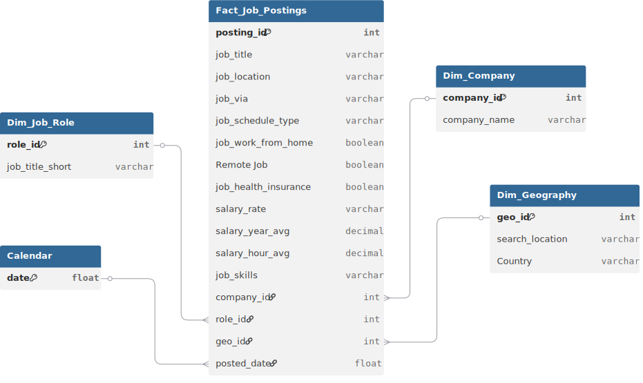

# 📊 Project Background: The Career Pivot Strategic Analytics

In late 2024, I found myself at a critical career crossroads. As an aspiring data professional looking to break into the **United States tech market**, I was paralyzed by "Information Overload." Every job board gave conflicting advice: some said to learn Cloud Engineering, others insisted on Deep Learning, while salary expectations for "Data Analysts" seemed to fluctuate wildly between states. I was applying blindly, wasting hours on roles that didn't align with my financial goals or technical strengths.

**The mission was to "Analyze the Analyzers."** To solve my own career stagnation, I secured a specialized dataset from **"InsightConnect US"**—an premium recruitment aggregator that archives verified high-tier tech postings across the United States. I treated my job search as a business problem, analyzing thousands of postings to identify the "Salary Sweet Spots," the most recession-proof skills, and the geographic hubs where my ROI would be highest. This analysis didn't just find me a job; it created my career roadmap.

Insights and recommendations are provided on the following key areas:

* **Role-Based Salary Tiers** (Data Scientist vs. Data Engineer vs. Analyst)
* **The Tech Stack Matrix** (Python, SQL, and the Power of Cloud)
* **Geographic Hubs vs. Remote Work** (Mapping the Pay Gap)
* **Hiring Seasonality** (When the US Market Peaks)

https://github.com/user-attachments/assets/ddbca766-2101-4bee-bffb-413a3a06f747

**Excel Formulas regarding various analytical calculations can be found [[here]](https://github.com/mehedibhai101/Data_Science_Jobs_Analytics/blob/main/Calculations/formulas.md).**

---

# 🏗️ Data Structure & Investigative Scope

The analysis was performed on a comprehensive **US-based job market dataset**, tracking thousands of active postings to decode the hiring landscape.

* **`Financial Metrics`:** `salary_year_avg`, `salary_hour_avg`, and `salary_rate` (Yearly vs. Hourly).
* **`Role Intelligence`:** Categorization into `job_title_short` (e.g., Data Scientist, Data Engineer, Senior Data Analyst).
* **`Technical Requirements`:** Extraction of `job_skills` (e.g., Python, SQL, Tableau, AWS, Spark).
* **`Work Dynamics`:** Analysis of `job_schedule_type` (Full-time vs. Contractor) and `job_work_from_home` status.
* **`Market Geography`:** Mapping of `job_location` across US states and cities to identify local pay premiums.

### 🗺️ Entity Relationship Diagram (ERD)


---

# 📋 Executive Summary

The US Data Science market is heavily stratified, with **Senior Data Scientists and Data Engineers** commanding the highest salary premiums. The analysis revealed a significant "Skill-Pay Gap": while **SQL** is the most frequently requested skill for volume, specialized tools like **Spark and AWS** act as "Profit Multipliers" for salary. Crucially, the data exposed that **Remote Work** is no longer a niche perk but a competitive standard, though **California and New York** still maintain a slight "Cost of Living" salary lead for on-site roles.


---

# 🔍 Strategic Insights

### 🌍 Geography & Work Environment

* **The Coastal Pay Premium:** **California (Silicon Valley/Palo Alto)** and **New York** remain the highest-paying hubs. However, when adjusted for cost of living, "Remote" roles often provide a better net financial outcome for mid-level professionals.
* **The Remote Revolution:** Over 30% of high-paying Data Scientist roles are now listed as **Work From Home (WFH)**, suggesting that geographic location is becoming secondary to technical mastery.
* **State-Level Variance:** Texas (Austin) and Washington (Seattle) have emerged as secondary powerhouses, offering salaries that rival the coasts but with significantly different tax implications.

### 🛠️ Technical Skill & Role Analysis

* **The "Trifecta" of Stability:** **SQL, Python, and Tableau/Power BI** are the non-negotiable foundations. Roles requiring this core stack have the highest volume of postings but also the highest competition.
* **The Engineering Edge:** **Data Engineers** often earn a higher base salary than Data Analysts. The requirement for "Cloud Skills" (AWS/Azure) and "Big Data" (Spark/Hadoop) serves as a gatekeeper to the $150k+ salary bracket.
* **Seniority Surge:** There is a massive "Salary Jump" (often 40%+) when moving from a "Data Analyst" to a "Senior Data Analyst" or "Data Scientist" title, even if the underlying day-to-day tasks remain similar.

### 📈 Temporal & Company Trends

* **The Hiring Cycle:** Job postings tend to peak in the **first and third quarters (Q1 and Q3)**, aligning with fiscal year budget approvals and mid-year project expansions.
* **Company Profiles:** Large-scale tech firms and financial institutions (like Cognizant or Randstad) dominate the posting volume, but boutique tech firms in the **Contractor** segment offer higher hourly rates for specialized projects.

---

# 🚀 Strategic Recommendations

* **Upskill into Cloud/Big Data:** To break the $130k barrier, I prioritized learning **AWS and Spark**. The data shows that these skills move a candidate from the "Analyst" tier into the more lucrative "Engineer/Scientist" tier.
* **Target "Remote-First" Companies:** For maximum work-life balance without sacrificing pay, I shifted my search to focus on companies offering **Remote Job** status, as their salary rates are often pegged to national averages rather than local rural rates.
* **Q1/Q3 Application Blitz:** Based on the seasonality data, I timed my most aggressive application phases for **January and August** to coincide with the highest volume of new US job postings.
* **Role Title Optimization:** I adjusted my resume to highlight "Engineering" and "Senior" capabilities. The data proves that **Title Branding** is as important as skill set when navigating automated HR filters (ATS).

---

## ⚠️ Assumptions and Caveats

* **Salary Imputation:** Not all job postings include a salary range. The analysis relies on the `salary_year_avg` provided, which may skew toward companies that are more transparent about pay.
* **Skill Extraction:** The `job_skills` field was parsed from JSON-like strings; some niche or emerging tools may have been under-represented if they weren't explicitly tagged.
* **Market Snapshot:** This data represents a specific window in time. US market conditions are dynamic, and current inflation or tech-sector layoffs may have shifted these baselines since the data was collected.

---

## 📂 Repository Structure

```
Data_Science_Jobs_Analytics/
│
├── Dataset/                              # The data foundation of the project
│   ├── entity_relationship_diagram.svg   # Visual map of table connections and cardinality
│   └── jon_postings.csv
├── Calculations/formulas.md              # Excel Formulas regarding analytical calculations
│
├── LICENSE                               # Legal terms for code and data usage
└── README.md                             # Project background, summary and key insights
``` 

---

## 🛡️ License

This project is licensed under the [MIT License](LICENSE). You are free to use, modify, and distribute it with proper attribution.

---

## 🌟 About Me

Hi! I’m **Mehedi Hasan**, well known as **Mehedi Bhai**, a Certified Data Analyst with strong proficiency in *Excel*, *Power BI*, and *SQL*. I specialize in data visualization, transforming raw data into clear, meaningful insights that help businesses make impactful data-driven decisions.

Let’s connect:

[](https://www.linkedin.com/in/mehedi-hasan-b3370130a/)
[](https://youtube.com/@mehedibro101?si=huk7eZ05dOwHTs1-)
